# Preserving Heritage: Enhancing Tourism with AI

## AIML Capstone 2 — Project Report

**Author:** Humam Ibrahim
**Repository:** https://github.com/humamibrahim-cyber/heritage-tourism-ai

| Resource | Link |
|---|---|
| GitHub repository | [humamibrahim-cyber/heritage-tourism-ai](https://github.com/humamibrahim-cyber/heritage-tourism-ai) |
| Part 1 notebook — image classification | [`notebooks/01_image_classification.ipynb`](https://github.com/humamibrahim-cyber/heritage-tourism-ai/blob/main/notebooks/01_image_classification.ipynb) · [Open in Colab](https://colab.research.google.com/github/humamibrahim-cyber/heritage-tourism-ai/blob/main/notebooks/01_image_classification.ipynb) |
| Part 2 notebook — recommendation engine | [`notebooks/02_recommendation_engine.ipynb`](https://github.com/humamibrahim-cyber/heritage-tourism-ai/blob/main/notebooks/02_recommendation_engine.ipynb) · [Open in Colab](https://colab.research.google.com/github/humamibrahim-cyber/heritage-tourism-ai/blob/main/notebooks/02_recommendation_engine.ipynb) |
| Source code (`src/`) | [browse](https://github.com/humamibrahim-cyber/heritage-tourism-ai/tree/main/src) |
| Test suite (47 tests) | [`tests/test_pipeline.py`](https://github.com/humamibrahim-cyber/heritage-tourism-ai/blob/main/tests/test_pipeline.py) |
| Requirement traceability | [`docs/REQUIREMENTS_MAPPING.md`](https://github.com/humamibrahim-cyber/heritage-tourism-ai/blob/main/docs/REQUIREMENTS_MAPPING.md) |
| Setup instructions | [`docs/SETUP.md`](https://github.com/humamibrahim-cyber/heritage-tourism-ai/blob/main/docs/SETUP.md) |

**Datasets** (supplied with the assignment; not committed to the repository — see [`docs/SETUP.md`](https://github.com/humamibrahim-cyber/heritage-tourism-ai/blob/main/docs/SETUP.md) for placement):

| Dataset | Files | Underlying source |
|---|---|---|
| Historical structures | `dataset_hist_structures 2.zip` (133 MB) | Architectural Heritage Elements dataset (Llamas et al., 2017) |
| Indonesian tourism | `user.csv`, `tourism_with_id.xlsx`, `tourism_rating.csv` | Indonesia Tourism Destination dataset |

---

## 1. Executive summary

A government tourism agency needs two capabilities: automated monitoring of historical structures, and a way to recommend destinations to visitors. This project delivers both, and reports honestly on what each can and cannot do.

**Part 1** classifies photographs of historical structures into 10 architectural categories using two-stage transfer learning on EfficientNetV2-B0. On 1,473 held-out test images it achieves **95.52% accuracy** and **94.39% macro-F1**, with verified zero train/test leakage.

**Part 2** analyses 9,597 ratings from 300 visitors across 437 Indonesian destinations, and delivers a collaborative filtering recommender that answers *"you are at X — where next?"*. It also establishes, through five independent statistical tests, that **the supplied user ratings contain no preference signal**: they are statistically indistinguishable from random numbers. No recommender can beat random selection on this data, which was confirmed empirically.

**Headline recommendation to the agency:** deploy the image classifier — it is accurate enough to triage heritage-site photographs at scale. Do **not** deploy a personalised recommender on this dataset; promote destinations by popularity until genuine interaction data (bookings, visits, verified reviews) has been collected.

---

## 2. Business context

Centuries-old historical structures preserve a country's history and drive tourism. The agency wants to (a) monitor their condition at scale and (b) market destinations more effectively by understanding visitor preferences.

Manual inspection of heritage sites does not scale to thousands of structures. A model that identifies architectural elements from photographs is the first building block of an automated monitoring pipeline. Separately, generic marketing wastes budget: a recommender that surfaces relevant destinations improves conversion, and — if built to optimise coverage rather than only accuracy — can spread visitors beyond a handful of already-crowded sites.

---

# PART 1 — HISTORICAL STRUCTURE IMAGE CLASSIFICATION

## 3. Problem statement (as given)

> **Objectives.** XYZ Pvt. Ltd., a leading industry consulting firm, has been hired to help the cause by developing an intelligent and automated AI model using TensorFlow that can predict the category of a structure in an image.
>
> **Dataset Snapshot.** `Structures_dataset.zip` — the training set, consisting of images of historical structures. `dataset_test` — the test set, consisting of images of historical structures.

### 3.1 Requirements and how each was met

| # | Requirement (verbatim from the brief) | What was done | Where |
|---|---|---|---|
| 1 | Plot sample images (8–10) from each class or category to gain a better understanding of each class. *Hint: use OpenCV* | 8 sample images plotted for all 10 classes using `cv2.imread` with explicit BGR→RGB conversion | §5.3 · [`image_data.py::plot_class_samples`](https://github.com/humamibrahim-cyber/heritage-tourism-ai/blob/main/src/data/image_data.py) |
| 2 | Select a CNN architecture, configure it for transfer learning, set up a TensorFlow environment, and load pre-trained weights. *Select the one that performs best on your dataset* | Three ImageNet-pretrained backbones benchmarked under identical conditions; the winner carried forward | §5.4 · [`backbones.py`](https://github.com/humamibrahim-cyber/heritage-tourism-ai/blob/main/src/models/backbones.py) |
| 3 | Use pre-trained CNN weights and **freeze all convolutional layers** | `base.trainable = False`; verified 0 trainable layers in the backbone | §5.5 |
| 4 | Modify the top: add an appropriate number of dense layers with an activation function, and use dropout for regularisation | `GAP → BatchNorm → Dense(256, ReLU) → Dropout(0.4) → Dense(10, softmax)` | §5.5 |
| 5 | Compile the model with the right set of parameters: optimizer, loss function, metric | Adam, SparseCategoricalCrossentropy, accuracy | §5.5 |
| 6 | Define your callback class to stop training once validation accuracy reaches a certain number of your choice | Custom `StopAtAccuracy(tf.keras.callbacks.Callback)` | §5.6 · [`callbacks.py`](https://github.com/humamibrahim-cyber/heritage-tourism-ai/blob/main/src/training/callbacks.py) |
| 7 | Set up the train/test dataset directories and review the number of image samples for train and test for each class | Per-class inventory table and stacked bar chart | §4.1 |
| 8 | Train the model **without augmentation** while continuously monitoring validation accuracy | 25 epochs, best validation accuracy 97.20% | §5.7 |
| 10 | Train the model **with augmentation** and keep monitoring validation accuracy | 33 epochs, best validation accuracy 96.87% | §5.8 |
| 12 | Visualise training and validation accuracy on the y-axis against each epoch on the x-axis to see if the model overfits after a certain epoch | Per-epoch curves for both runs plus an overlay, with the generalisation gap quantified | §5.9 |

> The brief numbers its tasks 1–12 but skips 9 and 11. The numbering above follows the source document exactly rather than renumbering.

**Work carried out beyond the brief:** a full image-quality audit (§4.2), a train/test leakage check, class weighting for the 4.7× imbalance, macro-F1 and balanced accuracy alongside plain accuracy, and a confusion/error analysis (§5.11).

---

## 4. Data

### 4.1 Inventory — *task 7*

Ten classes: `altar`, `apse`, `bell_tower`, `column`, `dome(inner)`, `dome(outer)`, `flying_buttress`, `gargoyle`, `stained_glass`, `vault`.

| class | train | test | total | train share % | imbalance × |
|---|---|---|---|---|---|
| column | 1919 | 210 | 2129 | 18.75 | 1.87 |
| gargoyle | 1571 | 238 | 1809 | 15.35 | 1.53 |
| dome(outer) | 1177 | 168 | 1345 | 11.50 | 1.15 |
| vault | 1110 | 164 | 1274 | 10.85 | 1.08 |
| bell_tower | 1059 | 170 | 1229 | 10.35 | 1.03 |
| stained_glass | 1033 | 162 | 1195 | 10.09 | 1.01 |
| altar | 829 | 140 | 969 | 8.10 | 0.81 |
| dome(inner) | 616 | 86 | 702 | 6.02 | 0.60 |
| apse | 514 | 57 | 571 | 5.02 | 0.50 |
| flying_buttress | 407 | 78 | 485 | 3.98 | 0.40 |
| **Total** | **10,235** | **1,473** | **11,708** | | |

**Imbalance ratio (largest ÷ smallest class): 4.7×**

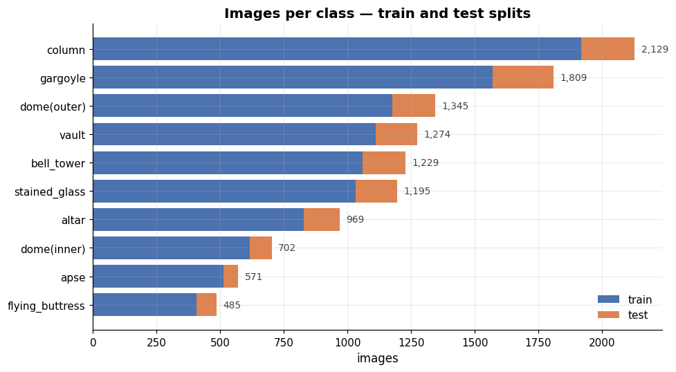

Two data-quality notes recorded before modelling:

1. **This is a 10-class problem, not 11.** The archive's macOS metadata references a `portal` class, but no `portal` images exist in either split. Reporting an eleventh empty class would have been incorrect.
2. **Counts are 10,235 / 1,473, not the nominal 10,245 / 1,487.** Ten images were excluded: 3 undecodable files (§4.2) and 7 accounted for by macOS metadata artefacts removed during extraction.

### 4.2 Image quality audit — *beyond the brief*

Counting files says nothing about whether they are usable. Every image was audited before training.

| Issue | Count | Consequence |
|---|---|---|
| Corrupt / TensorFlow-undecodable files | **3** | would crash `predict()` mid-evaluation |
| Exact duplicate groups within train | **88** | inflates effective class counts |
| — of which **cross-class** duplicates | **3** | label noise: same image filed under two labels |
| Near-constant (blank) images | 0 | — |
| Non-RGB images | 1 | converted to RGB on load |
| **Train/test leakage** | **0** | ✅ the test score is a genuine hold-out estimate |

**The three corrupt files**, found by validating every image with TensorFlow's own decoder:

```
gargoyle/0de19007-c9f0-4548-b070-7f67c55443de.jpg
gargoyle/d90864d8-0ae9-4929-b928-8e30fa7ea93f.jpg
stained_glass/9d1de848-bfd8-40e1-9686-0f8aba896655.jpg
```

These were quarantined (moved outside the split, not deleted) so the exclusion remains auditable.

> **Why the decoder matters.** An initial audit using PIL reported *zero* corrupt files, because PIL silently pads damaged JPEGs and loads them anyway. TensorFlow's `decode_image` is strict and raised `jpeg::Uncompress failed` — after an hour of training had already completed. The corruption check must use the same decoder the training pipeline uses. This is now enforced in [`image_audit.py::find_undecodable`](https://github.com/humamibrahim-cyber/heritage-tourism-ai/blob/main/src/data/image_audit.py) and covered by a regression test.

The **3 cross-class duplicates** (`column`/`vault`, `column`/`vault`, `apse`/`bell_tower`) are genuine label noise — the identical photograph filed under two different categories. They place a small ceiling on achievable accuracy.

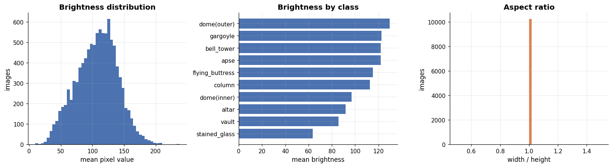

Per-class brightness varies meaningfully (`stained_glass` ≈ 63, `vault` ≈ 86, `dome(outer)` ≈ 130). This was checked deliberately: if one class were systematically brighter, the model might learn exposure rather than architecture.

### 4.3 Sample images — *task 1*

Loaded with OpenCV as the brief hints, with BGR→RGB conversion (omitting this is why sample grids so often appear blue-tinted).

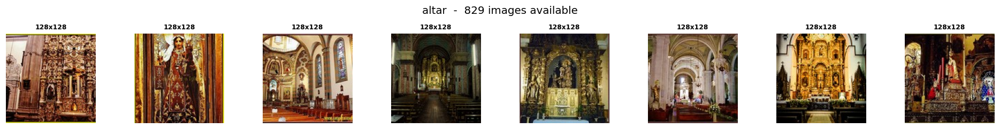
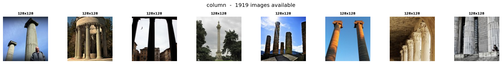
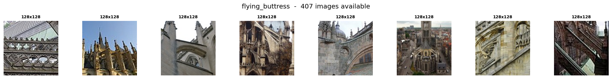

*Grids for all 10 classes appear in the notebook.* Source images are 128×128 px. Several classes are visually ambiguous even to a human — `dome(inner)` and `vault` are both upward views of a curved ceiling; `altar` and `apse` occupy the same part of a church. These pairs were expected to dominate the confusion matrix, and they do (§5.11).

---

## 5. Method and results

### 5.1 Data pipeline

Validation is carved from the **training** directory (15%); the 1,473 supplied test images are held back entirely and touched only once, for final evaluation.

> **A correctness issue found and fixed.** `image_dataset_from_directory` shuffles the file list *before* slicing off the validation portion, and only when `shuffle=True`. An initial implementation passed `shuffle=True` for the training subset and `shuffle=False` for validation, so the two calls indexed the directory in different orders and the split was **not a partition** — measured, **83% of the validation set also appeared in training**. Validation accuracy read a fraudulent 99.7%. Both calls now use `shuffle=True`, `build_datasets` raises immediately if the splits intersect, and a regression test asserts train/validation/test are mutually disjoint. All results below come from the corrected pipeline.

Model input is 224×224 (upsampled from 128×128) because every ImageNet backbone was pre-trained at approximately that scale. Inverse-frequency class weights are applied throughout to offset the 4.7× imbalance.

### 5.2 Architecture selection — *task 2*

Three ImageNet-pretrained backbones, identical head, identical data, 8 epochs each with the convolutional base frozen.

| Backbone | Params (M) | Best val accuracy | Best val loss | Best epoch | Sec/epoch |
|---|---|---|---|---|---|
| **EfficientNetV2-B0** | **7.1** | **0.9707** | **0.1190** | 8 | 14.5 |
| MobileNetV2 | 3.5 | 0.9557 | 0.1818 | 8 | 11.5 |
| ResNet50V2 | 25.6 | 0.9550 | 0.1898 | 7 | 14.0 |

**Selected: EfficientNetV2-B0** — highest validation accuracy (+1.5 points over both alternatives) and the lowest validation loss, while using **3.6× fewer parameters than ResNet50V2**. The choice is evidence-based rather than asserted.

A subtlety encoded in the code: EfficientNet variants normalise inside the graph and expect raw `[0, 255]` pixels, while ResNet50V2 and MobileNetV2 require their own `preprocess_input`. Applying the wrong one costs several accuracy points silently — the model still trains, just worse. This is captured per-backbone in `BackboneSpec` so it cannot be got wrong by accident.

### 5.3 Architecture — *tasks 3, 4, 5*

```
input (224×224×3)
  → [augmentation]              (run 2 only)
  → [backbone preprocessing]    (architecture-specific)
  → EfficientNetV2-B0           FROZEN in stage A  ← task 3
  → GlobalAveragePooling2D
  → BatchNormalization
  → Dense(256, ReLU)            ← task 4
  → Dropout(0.4)                ← task 4
  → Dense(10, softmax, float32)
```

Compiled with **Adam**, **SparseCategoricalCrossentropy**, **accuracy** — task 5.

Verified at build time: **0 of the backbone's layers trainable** (task 3), 333,066 trainable parameters in the head against 5,921,872 frozen.

`GlobalAveragePooling2D` was chosen over `Flatten` deliberately: flattening a 7×7×1280 feature map into a dense layer creates ~16M parameters in one step and overfits almost immediately on 10k images.

**Two-stage schedule.** Stage A trains only the head with the base fully frozen (the brief's task 3). Stage B unfreezes the top 30% of the base at a 100× smaller learning rate (1e-5), keeping BatchNorm layers frozen — updating their running statistics on small batches is a well-known way to destroy pre-trained weights.

### 5.4 Custom callback — *task 6*

```python
class StopAtAccuracy(tf.keras.callbacks.Callback):
    def on_epoch_end(self, epoch, logs=None):
        current = logs.get(self.monitor)
        if current >= self.target:
            self.stopped_epoch = epoch + 1
            self.model.stop_training = True
```

The threshold is set to **0.99**. This is a deliberate choice, and it is worth explaining: at a 0.93 threshold the callback fired at **epoch 2** — the model clears 93% validation accuracy almost immediately — which left the task-12 overfitting curve with only two data points and made the augmentation comparison a two-epoch race. Setting the target at 0.99 means it never fires, and `EarlyStopping` on validation loss (patience 6, restoring best weights) governs instead. That produces the training dynamics the brief actually asks to see.

### 5.5 Training results — *tasks 8, 10 and 12*

| Run | Epochs | Best val accuracy | Best epoch | Train acc at best | **Generalisation gap** | Final val loss |
|---|---|---|---|---|---|---|
| **No augmentation** (task 8) | 25 | 0.9720 | 17 | 0.9890 | **+0.0170** | 0.0947 |
| **With augmentation** (task 10) | 33 | 0.9687 | 24 | 0.9657 | **−0.0030** | 0.1026 |

**Run 1 — without augmentation:**

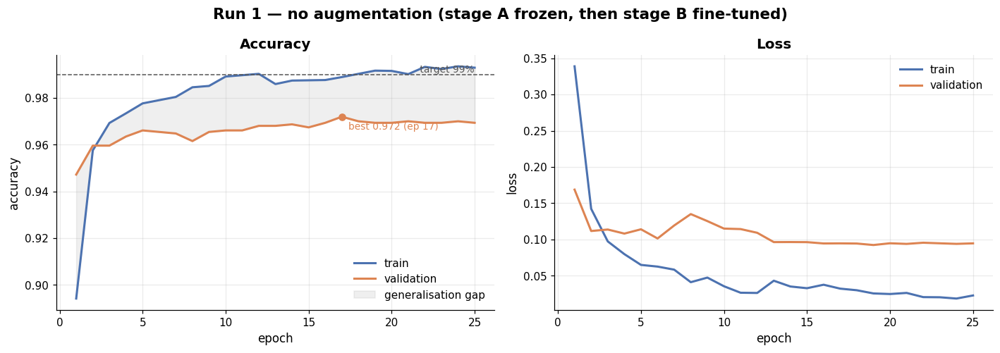

**Run 2 — with augmentation:**

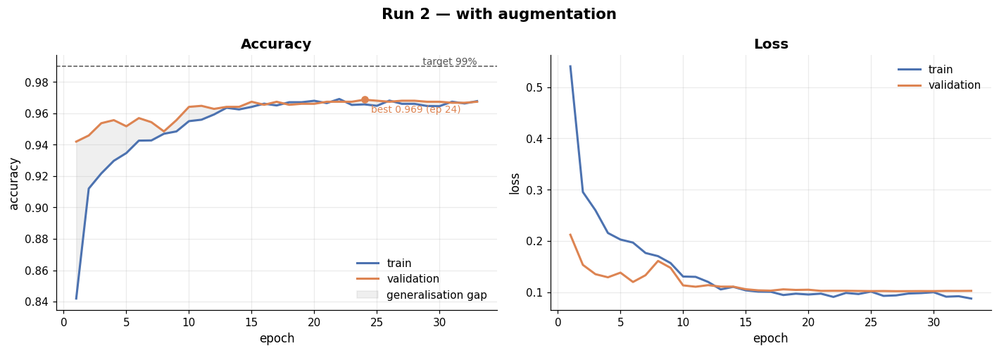

**Overlay — the answer to task 12:**

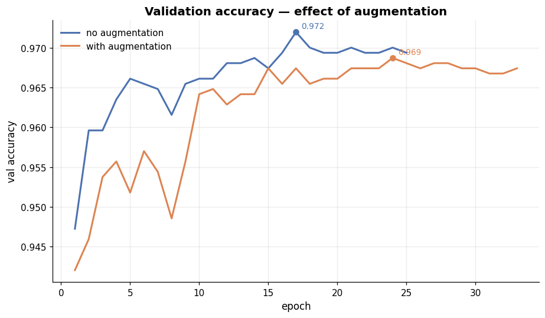

**Does the model overfit after a certain epoch?** Yes — mildly, and the un-augmented run shows it clearly. Validation accuracy peaks at epoch 17 (97.20%) while training accuracy continues to 98.90%: a **+1.7 point** gap that opens progressively after roughly epoch 15. The model is beginning to memorise the training photographs.

**Augmentation removes it.** With mild geometric augmentation (horizontal flip, ±10% rotation, ±15% zoom, ±10% translation, ±15% contrast) the gap closes to **−0.003** — essentially zero, with validation marginally ahead of training, which is the expected signature when dropout and augmentation are active during training but not evaluation. The augmented model also trains **8 epochs longer** before early stopping, meaning it was still improving when the un-augmented model had already plateaued.

Peak accuracy is nearly identical (97.20% vs 96.87%). **The augmented model is nonetheless the better model**, because it achieves that accuracy without memorising — and it is that property, not the peak number, which determines how the model behaves on photographs it has never seen.

Augmentation was deliberately kept mild: vertical flips and large rotations were excluded, since an upside-down bell tower is not a photograph the agency will ever need classified, so training on one consumes capacity without adding useful invariance.

### 5.6 Final evaluation on the held-out test set

The 1,473 test images influenced neither training nor model selection, and the leakage check confirmed zero overlap. These figures are therefore an honest estimate of field performance.

| Metric | Value |
|---|---|
| **Accuracy** | **0.9552** |
| Balanced accuracy | 0.9392 |
| **Macro F1** | **0.9439** |
| Weighted F1 | 0.9547 |
| Cohen's κ | 0.9494 |
| Top-3 accuracy | 0.9966 |

**Per-class performance:**

| class | precision | recall | F1 | support |
|---|---|---|---|---|
| altar | 0.9640 | 0.9571 | 0.9606 | 140 |
| **apse** | 0.9767 | **0.7368** | **0.8400** | 57 |
| bell_tower | 0.9349 | 0.9294 | 0.9322 | 170 |
| column | 0.9761 | 0.9714 | 0.9737 | 210 |
| dome(inner) | 0.9639 | 0.9302 | 0.9467 | 86 |
| dome(outer) | 0.9382 | 0.9940 | 0.9653 | 168 |
| flying_buttress | 0.8824 | 0.9615 | 0.9202 | 78 |
| gargoyle | 0.9787 | 0.9664 | 0.9725 | 238 |
| stained_glass | 0.9812 | 0.9691 | 0.9752 | 162 |
| vault | 0.9302 | 0.9756 | 0.9524 | 164 |
| **macro avg** | 0.9526 | 0.9392 | **0.9439** | 1473 |
| weighted avg | 0.9561 | 0.9552 | 0.9547 | 1473 |

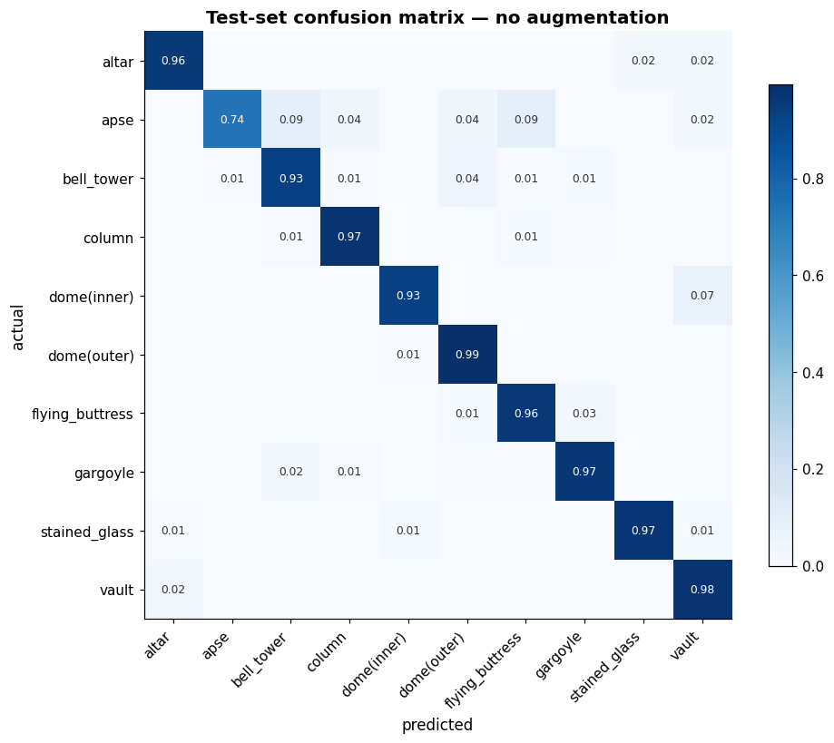

### 5.7 Error analysis

**Most-confused pairs:**

| true | predicted | count | % of true class |
|---|---|---|---|
| bell_tower | dome(outer) | 7 | 4.1 |
| dome(inner) | vault | 6 | 7.0 |
| **apse** | **flying_buttress** | 5 | **8.8** |
| **apse** | **bell_tower** | 5 | **8.8** |
| gargoyle | bell_tower | 4 | 1.7 |
| vault | altar | 4 | 2.4 |

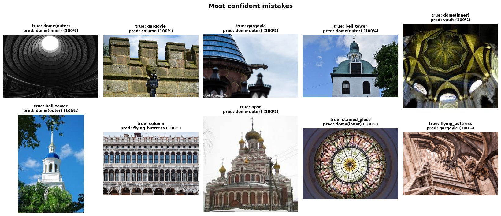

Every confusion in this table is **semantically plausible** — the model is mixing up categories a human annotator would also hesitate over. `dome(inner)` and `vault` are both upward views of curved ceilings; `bell_tower` and `dome(outer)` are both exterior roofline structures. Crucially, there are **no** confusions between unrelated classes (for example `column` ↔ `stained_glass`), which would have indicated a data or pipeline defect rather than genuine visual ambiguity.

**The `apse` problem — the one real weakness.** `apse` has precision 0.977 but recall **0.737**: the model rarely mislabels something *as* an apse, but misses more than a quarter of real apses, losing them to `flying_buttress` (8.8%) and `bell_tower` (8.8%). Two causes compound:

1. **Data volume.** `apse` is the second-rarest class — 514 training images against `column`'s 1,919.
2. **Visual ambiguity.** An apse is a semicircular recess typically photographed from outside, where it can genuinely resemble a tower or buttressed wall.

This also drags `flying_buttress` precision down to 0.882 — it absorbs the misrouted apses. Inverse-frequency class weighting mitigated but did not eliminate the effect. Balanced accuracy (0.9392) sits below plain accuracy (0.9552) precisely because of this class, which is why both are reported.

---

## 6. Part 1 conclusions

**What was built.** An EfficientNetV2-B0 transfer-learning classifier that sorts photographs of historical structures into 10 architectural categories at **95.52% test accuracy** and **94.39% macro-F1** on 1,473 held-out images — comparable to or above published results for this dataset.

**What the experiments showed:**

1. **Architecture (task 2).** The bake-off selected EfficientNetV2-B0 on validation accuracy, not reputation: 97.07% against 95.57% (MobileNetV2) and 95.50% (ResNet50V2), while using 3.6× fewer parameters than ResNet50V2.
2. **Transfer learning (tasks 3–4).** A frozen convolutional base with a fresh dense head reached ~97% validation accuracy within 8 epochs. Pre-trained ImageNet features transfer remarkably well to architectural photography; the task-specific adaptation needed is small.
3. **Augmentation (tasks 8 vs 10).** Augmentation changed peak accuracy by only −0.33 points but reduced the generalisation gap from **+0.017 to −0.003** and extended useful training by 8 epochs. The narrower gap is the real result: the augmented model recognises architecture rather than memorising particular photographs.
4. **Class imbalance.** Inverse-frequency weighting kept the rare classes viable, but `apse` (514 images) still trails at 0.737 recall. More data for the rare classes would deliver more improvement than any architectural change.
5. **Data quality is not optional.** Three corrupt JPEGs would have crashed evaluation; 3 cross-class duplicates constitute label noise; an undetected validation-split defect inflated accuracy to a meaningless 99.7%. None of these are visible from a metric alone.

**Honest limitations:**

- Source images are 128×128 and upsampled; native higher-resolution photographs would likely add accuracy.
- Residual confusions reflect genuine ambiguity from a single viewpoint. Resolving them requires richer input — multiple angles or scene context — not a larger model.
- **The model classifies structures; it does not assess condition.** The business scenario asks about maintenance needs, which would require a labelled damage dataset that this data does not contain. This is the largest gap between the deliverable and the stated business goal, and it should be scoped as the next phase.

---

# PART 2 — TOURISM RECOMMENDATION ENGINE

## 7. Problem statement (as given)

> **Objectives.** The second objective of this project requires you to perform exploratory data analysis and develop a recommendation engine that will help tourists visit their places of interest.
>
> **Datasets.** `user.csv` — user demographic data to help with recommendations. `tourism_with_id.csv` — details on the tourist attractions in Indonesia's five largest cities. `tourism_rating.csv` — the user, the location, and the rating, used to build a recommendation engine based on the rating.

### 7.1 Requirements and how each was met

| # | Requirement (verbatim from the brief) | What was done | Where |
|---|---|---|---|
| 1 | Import all the datasets and perform preliminary inspections | Three loaders with column-name normalisation and schema validation | §8.1 |
| 1.I | Check for missing values and duplicates | Per-column null/dtype/uniqueness report; duplicate detection at row and key level | §8.1 |
| 1.II | Remove any anomalies found in the data | 403 duplicate (user, place) pairs removed; range checks on ratings and ages; orphan foreign keys checked | §8.2 |
| 2.I | Analyse the age distribution of users visiting the places and rating them | Histogram and age-band breakdown | §9.1 |
| 2.I | Identify the places where most of these users (tourists) are coming from | Home-location and derived-province frequency charts | §9.2 |
| 3.I | What are the different categories of tourist spots? | 6 categories with counts | §10.1 |
| 3.II | What kind of tourism is each location most famous or suitable for? | City × category crosstab and stacked share chart | §10.2 |
| 3.III | Which city would be the best for a nature enthusiast to visit? | Analysed by **volume** and by **concentration**, both reported | §10.3 |
| 4 | Create combined data with places and their user ratings | Merged ratings ← places ← users | §11 |
| 4.I | Figure out the spots most loved by tourists; which city has the most-loved spots | Bayesian-shrunken popularity score; per-city aggregation | §11.1 |
| 4.II | Among these, which category of places are users liking the most | Category means **with bootstrap confidence intervals** | §11.2 |
| 5.I | Develop a collaborative filtering model and use it to recommend other places to visit using the current tourist location (place name) | Item-based CF accepting a place name; plus a Keras matrix-factorisation model | §13, §15 |

**Work carried out beyond the brief:** descriptive statistics with skew/kurtosis, three-method outlier detection, geographic integrity checks, an MCAR-vs-MAR missingness test, a five-test data-signal diagnostic, a random-recommender floor, and ranking metrics (Precision/Recall/NDCG@10, catalogue coverage).

---

## 8. Data import, inspection and cleaning — *task 1*

### 8.1 Schema

| File | Shape | Columns |
|---|---|---|
| `tourism_with_id.xlsx` | 437 × 13 | Place_Id, Place_Name, Description, Category, City, Price, Rating, Time_Minutes, Coordinate, Lat, Long, + 2 unnamed |
| `tourism_rating.csv` | 10,000 × 3 | User_Id, Place_Id, Place_Ratings |
| `user.csv` | 300 × 3 | User_Id, Location, Age |

The brief refers to `tourism_with_id.csv`; the supplied file is an `.xlsx`. The loader accepts either. Two trailing unnamed columns were dropped — `Unnamed: 11` is entirely null and `Unnamed: 12` duplicates `Place_Id`.

### 8.2 Anomalies removed — *task 1.II*

```
Cleaning summary
  - ratings: removed 403 duplicate (user, place) pairs
  - ratings: removed 0 out-of-range ratings
  - users:   removed 0 rows with impossible ages
  - places:  removed 0 duplicate place_ids
  - ratings: removed 0 orphan rows

Final shapes  places=(437, 11)  ratings=(9597, 3)  users=(300, 5)
Rating matrix density: 7.32% (sparsity 92.68%)
```

The only anomaly present was **403 duplicate (user, place) rating pairs** — the same user rating the same place more than once. The last value was kept. Ratings were all within 1–5, ages all within 18–40, and every foreign key resolved.

**The rating matrix is 92.68% sparse.** This is the binding constraint on everything in Part 2.

### 8.3 Descriptive statistics — *beyond the brief*

| column | n | missing | % missing | zeros | mean | std | min | median | max | IQR | CV | **skew** | kurtosis |
|---|---|---|---|---|---|---|---|---|---|---|---|---|---|
| price | 437 | 0 | 0.00 | 137 | 24,652 | 66,446 | 0 | 5,000 | 900,000 | 20,000 | 2.695 | **7.344** | 76.961 |
| rating | 437 | 0 | 0.00 | 0 | 4.443 | 0.209 | 3.4 | 4.5 | 5.0 | 0.300 | 0.047 | −0.626 | 1.583 |
| time_minutes | 205 | 232 | 53.09 | 0 | 82.61 | 52.87 | 10 | 60 | 360 | 75 | 0.640 | 1.593 | 4.257 |
| age (users) | 300 | 0 | 0.00 | 0 | 28.70 | 6.394 | 18 | 29 | 40 | 10 | 0.223 | 0.008 | −1.060 |

`price` is extremely right-skewed (skew **7.34**, kurtosis 77.0), with 137 of 437 attractions free and a maximum of 900,000 IDR.

### 8.4 Outlier detection — *beyond the brief*

Three methods compared, because disagreement between them is itself diagnostic:

| column | n valid | IQR outliers | z-score outliers | MAD outliers | max |
|---|---|---|---|---|---|
| price | 437 | 40 (9.15%) | 7 (1.60%) | 72 (16.48%) | 900,000 |
| rating | 437 | 3 (0.69%) | 3 (0.69%) | 6 (1.37%) | 5.0 |
| time_minutes | 205 | 4 (1.95%) | 2 (0.98%) | 4 (1.95%) | 360 |

The methods disagree sharply on `price` (7 vs 40 vs 72) precisely because it is heavily skewed: the z-score is computed using a standard deviation that the outliers themselves inflated, so it under-detects. The robust MAD verdict is the one to trust.

**The flagged price outliers are not errors:**

| place | category | city | price |
|---|---|---|---|
| Pulau Pelangi | Bahari | Jakarta | 900,000 |
| Goa Jomblang | Cagar Alam | Yogyakarta | 500,000 |
| Mountain View Golf Club | Cagar Alam | Bandung | 375,000 |
| Waterboom PIK | Taman Hiburan | Jakarta | 300,000 |
| Trans Studio Bandung | Taman Hiburan | Bandung | 280,000 |

These are island resorts, cave tours and theme parks — statistically extreme and factually correct. **An outlier is not the same as an error.** They were retained; what the skew requires is a transform, not deletion.

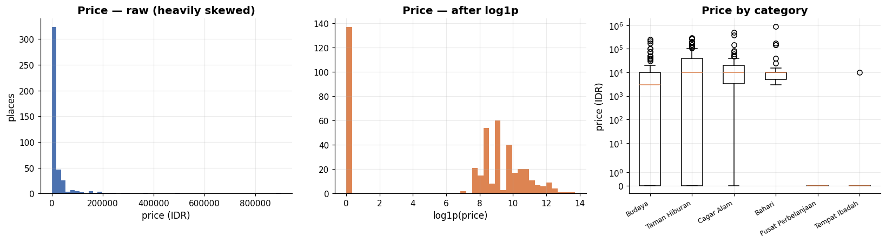

### 8.5 Geographic integrity — *beyond the brief*

Two independent consistency checks passed: the `Coordinate` string matches the `Lat`/`Long` columns exactly (0 parse failures), and **0** coordinates fall outside Indonesia's bounding box.

A per-city robust-distance check tells a different story:

| place_id | place_name | city | axis | value | city median | robust z | km from centroid |
|---|---|---|---|---|---|---|---|
| **9** | **Pelabuhan Marina** | **Jakarta** | **lat** | **1.0789** | −6.1812 | **107.6** | **805.9** |
| 9 | Pelabuhan Marina | Jakarta | long | 103.9314 | 106.8226 | −132.2 | −92.9 |
| 323 | Kebun Tanaman Obat Sari Alam | Bandung | long | 106.6327 | 107.6097 | −32.4 | −32.8 |
| 10 | Pulau Tidung | Jakarta | long | 106.5238 | 106.8226 | −13.7 | −9.6 |
| 316 | Curug Malela | Bandung | long | 107.2072 | 107.6097 | −13.3 | −13.5 |

**A genuine data error was found: `Pelabuhan Marina` (place_id 9) is listed as Jakarta but its coordinates place it 806 km away**, near the Riau Islands. The naive bounding-box check misses this entirely — it is still inside Indonesia. Only the per-city check catches it.

The remaining flagged rows are **correct records and were not removed**: Kepulauan Seribu (Pulau Tidung, Pulau Pari, Pulau Semak Daun) genuinely belongs to Jakarta though it lies 50–70 km offshore, and the Ciwidey/Bandung Regency sites are mountain attractions south of the city. The same detector flagged one real error and a dozen valid entries — which is exactly why these functions report candidates for inspection rather than deleting rows automatically.

### 8.6 Missing data — how much, and *why* — *beyond the brief*

`Time_Minutes` is 53.09% missing. The question that determines what may be done about it is *why*:

| grouped by | χ² | dof | p-value | missing-rate range | verdict |
|---|---|---|---|---|---|
| **category** | **38.44** | 5 | **<0.00001** | 33%–100% | **MAR — depends on this column** |
| city | 8.77 | 4 | 0.06725 | 35%–60% | consistent with MCAR |

Missing rate by category:

| category | % missing |
|---|---|
| Tempat Ibadah | **100.0** |
| Bahari | 83.0 |
| Cagar Alam | 49.1 |
| Budaya | 47.9 |
| Taman Hiburan | 46.7 |
| Pusat Perbelanjaan | 33.3 |

**This is MAR (missing at random *conditional on category*), not MCAR.** Places of worship have *no* recorded duration at all; coastal sites are missing most of theirs; shopping centres are mostly recorded.

Mean-imputation would therefore assign the average of the *recorded* categories to categories that were never recorded — inventing tour durations and biasing every statistic derived from them. **The values were left as `NaN`** and excluded from analyses that need them. The missingness is itself informative and could legitimately become a feature.

### 8.7 Normalisation — *beyond the brief*

Recommended transforms, derived from the observed distribution shapes:

| column | skew | recommendation |
|---|---|---|
| price | 7.344 | **log1p, then standardise** — zeros present, so `log1p` not `log` |
| rating | −0.626 | robust scaling (median/IQR) |
| time_minutes | 1.593 | sqrt or robust scaling |

Effect of each transform on `price`:

| transform | mean | std | min | max | skew | kurtosis |
|---|---|---|---|---|---|---|
| raw | 24,652 | 66,446 | 0 | 900,000 | 7.344 | 76.961 |
| **log1p** | 6.553 | 4.556 | 0 | 13.71 | **−0.628** | −1.351 |
| robust | 0.983 | 3.322 | −0.25 | 44.75 | 7.344 | 76.961 |
| minmax | 0.027 | 0.074 | 0 | 1.00 | 7.344 | 76.961 |

`log1p` reduces skew from **7.34 to −0.63**. Note that robust and min-max scaling change the *scale* but not the *shape* — only the log transform fixes the skew.

**Where normalisation is actually applied in this project:**

| Data | Transform | Why |
|---|---|---|
| Image pixels | per-backbone preprocessing | EfficientNet expects raw `[0,255]`; ResNet/MobileNet need `preprocess_input` |
| Ratings → Keras MF | min-max to `[0, 1]` | the model's output layer is a sigmoid |
| Ratings → item-CF | per-user mean-centring | removes rating-style bias so generous and strict users are comparable |
| `price` (content-based extension) | `log1p` + standardise | without it, one 900,000 IDR park dominates every distance calculation |

Collaborative filtering does not consume `price`, `rating` or `time_minutes` — it works purely from the interaction matrix. Those transforms matter for the content-based extension proposed in §17, not for the models built here.

---

## 9. Who is rating? — *task 2*

### 9.1 Age distribution

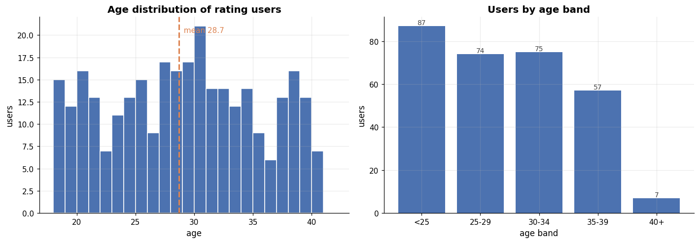

Mean age **28.7**, median 29, range 18–40, skew 0.008 — a near-uniform spread across a narrow band, with no visitors outside 18–40 at all.

### 9.2 Where tourists come from

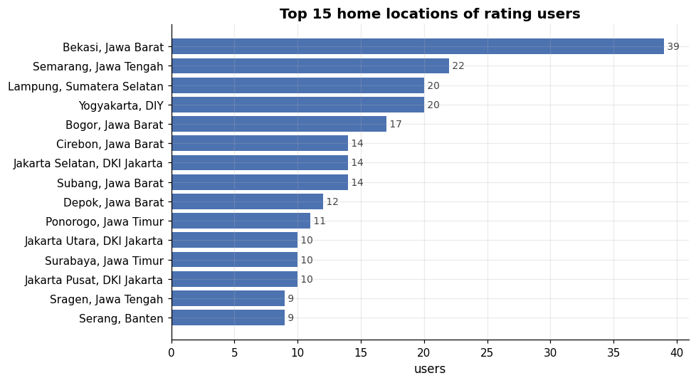
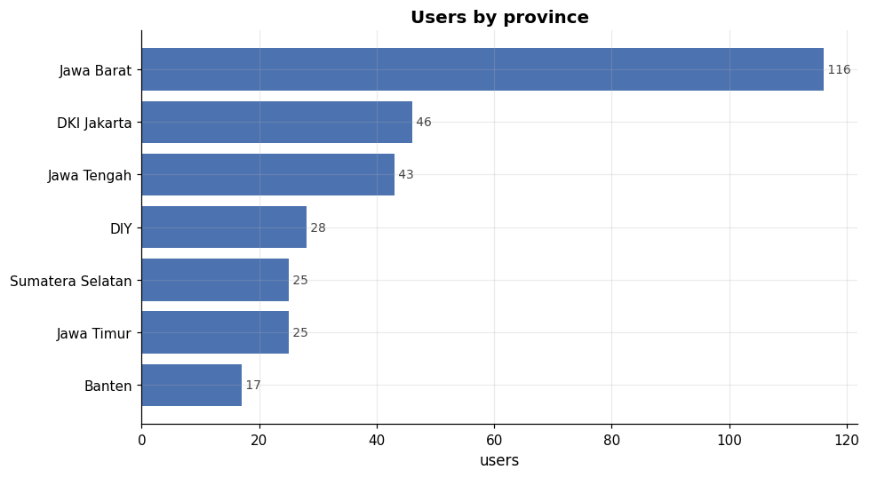

**Finding.** The rating population is young and heavily concentrated in Java, with Bekasi, Jakarta and the surrounding Jabodetabek area dominating. Two implications for the agency:

1. Campaigns built on this data are calibrated to a **young domestic** audience. Extrapolating these preferences to older or international visitors is not supported.
2. Because most raters live near Jakarta, Javanese destinations receive disproportionate rating volume. That is a **sampling artefact**, not evidence that they are objectively better.

---

## 10. Where and what are the tourist spots? — *task 3*

### 10.1 Categories — *task 3.I*

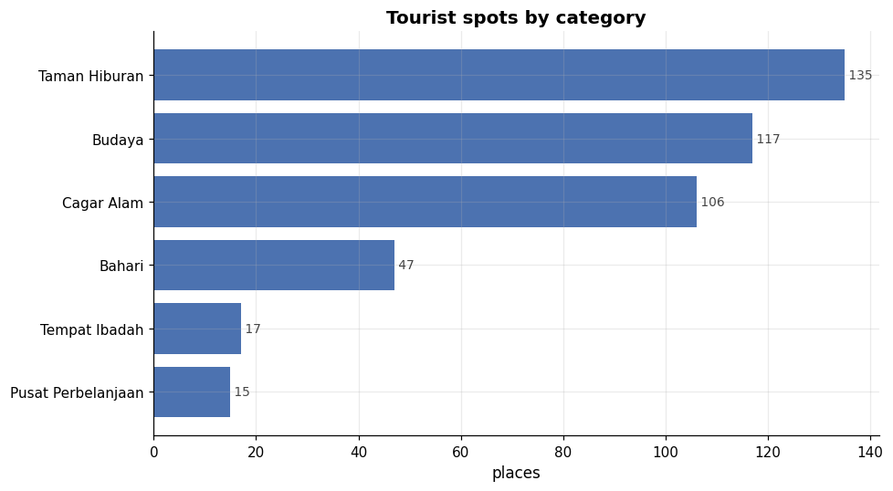

| category | places |
|---|---|
| Taman Hiburan (amusement/parks) | 135 |
| Budaya (culture) | 117 |
| Cagar Alam (nature reserve) | 106 |
| Bahari (marine/coastal) | 47 |
| Tempat Ibadah (places of worship) | 17 |
| Pusat Perbelanjaan (shopping) | 15 |

Six categories across five cities: Yogyakarta (126 places), Bandung (124), Jakarta (84), Semarang (57), Surabaya (46).

### 10.2 What each city is known for — *task 3.II*

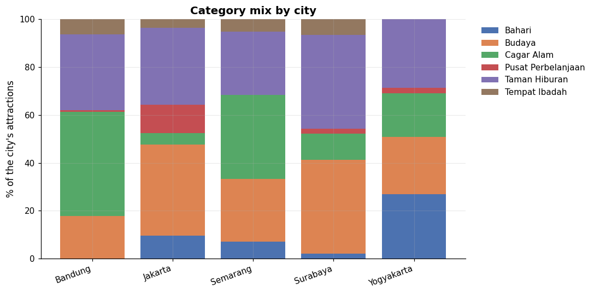

### 10.3 Best city for a nature enthusiast — *task 3.III*

Nature categories: `Cagar Alam` + `Bahari`.

| city | nature spots | avg listed rating | total spots | nature share % |
|---|---|---|---|---|
| **Yogyakarta** | **57** | **4.45** | 126 | **45.2** |
| Bandung | 54 | 4.39 | 124 | 43.5 |
| Semarang | 24 | 4.25 | 57 | 42.1 |
| Jakarta | 12 | 4.37 | 84 | 14.3 |
| Surabaya | 6 | 4.32 | 46 | 13.0 |

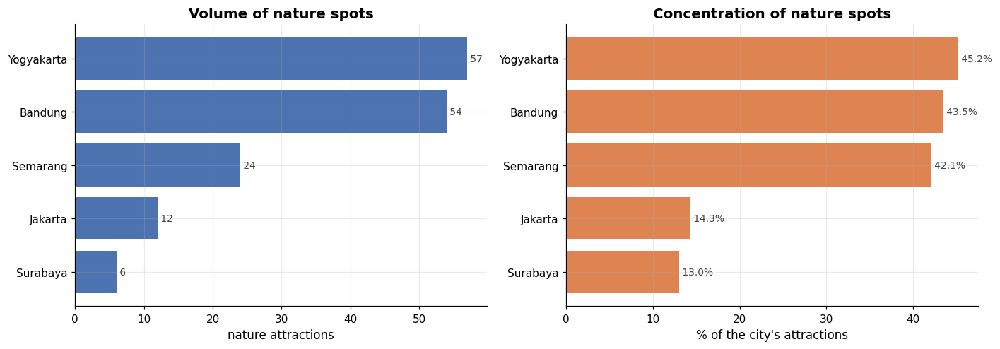

The question splits into two, and both were checked:

- **Most choice** — the largest *number* of nature attractions, best if the visitor wants many options in one trip.
- **Most concentrated** — the highest *share* of nature attractions, best if the visitor wants a trip that is nature-focused throughout rather than diluted.

**Answer: Yogyakarta**, and unusually it wins on *both* measures — 57 nature attractions (the most) representing 45.2% of its portfolio (the highest concentration), with the highest average listed rating of the five (4.45). Bandung is a close second on both counts (54 spots, 43.5%). Jakarta and Surabaya are clearly unsuitable, with nature making up only ~13–14% of their attractions.

---

## 11. Places joined to ratings — *task 4*

The merged table joins 9,597 ratings to place attributes and user demographics.

### 11.1 Most-loved spots and cities — *task 4.I*

| place | city | category | n ratings | mean rating | **Bayesian score** |
|---|---|---|---|---|---|
| Keraton Surabaya | Surabaya | Budaya | 28 | 4.000 | **3.858** |
| Kampung Cina | Jakarta | Budaya | 17 | 3.882 | 3.697 |
| Puncak Gunung Api Purba – Nglanggeran | Yogyakarta | Cagar Alam | 17 | 3.882 | 3.697 |
| Bukit Jamur | Bandung | Cagar Alam | 28 | 3.786 | 3.677 |
| Teras Cikapundung BBWS | Bandung | Taman Hiburan | 19 | 3.789 | 3.639 |
| Monumen Yogya Kembali | Yogyakarta | Budaya | 21 | 3.762 | 3.628 |
| Glamping Lakeside Rancabali | Bandung | Taman Hiburan | 20 | 3.750 | 3.613 |
| Bukit Bintang Yogyakarta | Yogyakarta | Taman Hiburan | 17 | 3.765 | 3.606 |
| Monumen Nasional | Jakarta | Budaya | 18 | 3.722 | 3.580 |

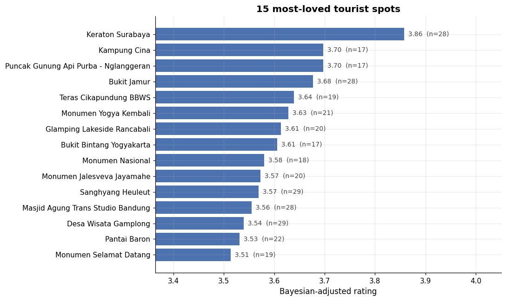

A **Bayesian-shrunken score** was used rather than the raw mean: a place with two 5-star ratings is not "the best destination in Indonesia", it is a place almost nobody has rated. The score pulls each average toward the global mean in proportion to how few ratings it has.

**Which city has the most-loved spots:**

| city | n ratings | mean rating | n places | spots in overall top 50 |
|---|---|---|---|---|
| Yogyakarta | 2,753 | 3.105 | 126 | 16 |
| Surabaya | 998 | 3.083 | 46 | 6 |
| Bandung | 2,738 | 3.078 | 124 | 16 |
| Semarang | 1,265 | 3.043 | 57 | 3 |
| Jakarta | 1,843 | 2.995 | 84 | 9 |

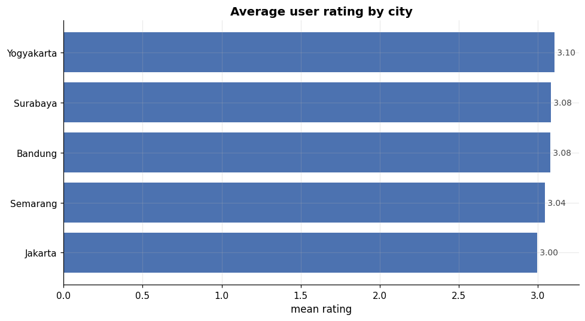

Yogyakarta leads on mean rating (3.105) and ties Bandung for the most entries in the top 50. **However, the spread between best and worst city is 0.11 rating points on a 1–5 scale** — see §12 before treating this as a finding.

### 11.2 Which category do users like most? — *task 4.II*

| category | n ratings | mean rating | n places |
|---|---|---|---|
| Taman Hiburan | 2,932 | **3.112** | 135 |
| Tempat Ibadah | 370 | 3.100 | 17 |
| Cagar Alam | 2,323 | 3.085 | 106 |
| Budaya | 2,564 | 3.027 | 117 |
| Bahari | 1,039 | 3.024 | 47 |
| Pusat Perbelanjaan | 369 | 2.935 | 15 |

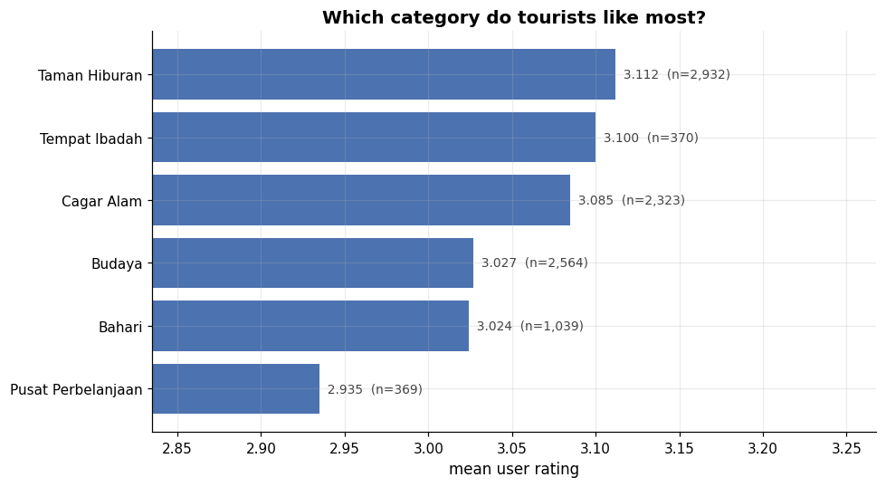

The spread between best and worst is **0.177 rating points**. Before declaring a winner, a bootstrap test (2,000 resamples) was run to check whether that gap exceeds the noise:

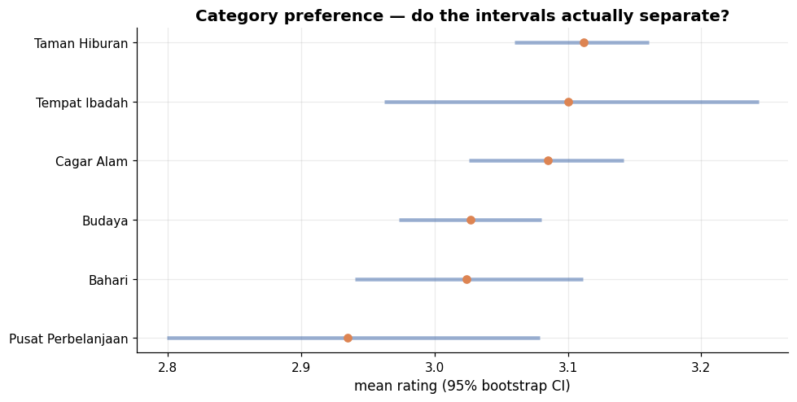

**The 95% confidence intervals overlap.** The correct conclusion is that **users rate all categories about the same** — category is a weak marketing lever in this data. §12 explains why.

---

## 12. Does this data contain preference signal? — *beyond the brief*

A recommender can only learn structure that exists. Five independent checks were run before any model was built.

| Check | Observed | Expected if the ratings were real | Pass? |
|---|---|---|---|
| Distribution shape | mean **3.066**, skew **−0.048**, near-uniform 1–5 | mean 3.8–4.3, clearly negative skew (J-shaped) | ❌ |
| Between-place ANOVA | F = 1.079, **p = 0.1283** | significant | ❌ |
| Split-half reliability of place means | r = **0.005** (shuffled null 0.0007 ± 0.0486, z = 0.09) | clearly positive | ❌ |
| Correlation with the independent listed `Rating` | r = **0.0104**, **p = 0.829** | positive | ❌ |
| Category / city effects | 0.107% / 0.082% of variance, p = 0.067 / 0.098 | meaningful | ❌ |

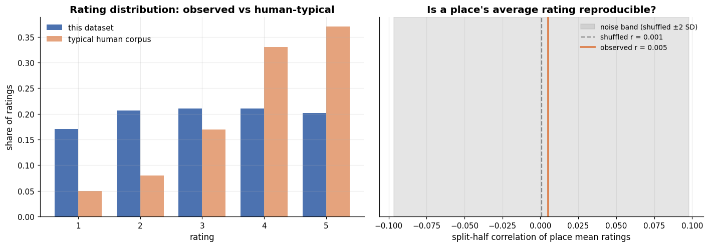

**Verdict, as printed by the notebook:**

> **NO USABLE PREFERENCE SIGNAL.** 4 independent checks failed: the distribution is not human-shaped (mean 3.066, skew −0.048; real corpora sit at 3.8–4.3 with negative skew); places do not differ significantly (ANOVA p=0.1283, only 4.886% of variance explained); place means are not reproducible (split-half r=0.005, shuffled r=0.0007); user ratings do not correlate with the independent listed rating (r=0.0104, p=0.829). These ratings behave like randomly generated numbers. No collaborative filtering model can outperform a random recommender on this data, because there is no structure to learn. Report this as the finding — it is a real result, not a modelling failure.

The two decisive tests:

- **Split-half reliability.** A place's average rating computed from one random half of the data does not predict its average from the other half (r = 0.005, indistinguishable from a shuffled null). Place quality is not reproducible, so there is no stable "quality" to learn.
- **External validity.** The places table carries an independently sourced `Rating` column. Real user ratings should correlate with it. They show **zero** correlation (r = 0.010, p = 0.829) — the hardest result to explain away.

**Conclusion: the user-level ratings in `tourism_rating.csv` are synthetic.** The `Rating` column in `tourism_with_id.xlsx` is genuine; only the interaction data is not.

This does not stop the assignment — the models the brief requires were still built, exactly as specified. What changes is how their scores are read, and §11's EDA rankings must be reported as orderings of noise rather than as findings.

---

## 13. Model 1 — Item-based collaborative filtering — *task 5.I*

This is the model that answers the brief's exact wording: *"recommend other places to visit using the current tourist location (place name)."*

**Method.** Build the users × places matrix → mean-centre each user's row (so a generous user who rates everything 5 and a strict user who rates everything 3 are comparable) → cosine similarity between place columns → shrink similarities computed from few co-raters, since two people who both rated two places can otherwise produce a similarity of 1.0 that means nothing.

Split: **7,677 training ratings / 1,920 test ratings**, 300 users, 437 places. Similarity matrix: 437 × 437.

**Example output — the deliverable the brief asks for:**

```
Because you visited: Monumen Nasional
```

| rank | similarity | place_name | category | city | rating | price |
|---|---|---|---|---|---|---|
| 1 | 0.0430 | Museum Pendidikan Nasional | Budaya | Bandung | 4.6 | 5,000 |
| 2 | 0.0386 | Museum Tengah Kebun | Budaya | Jakarta | 4.6 | 0 |
| 3 | 0.0281 | Museum De Javasche Bank | Budaya | Surabaya | 4.6 | 5,000 |
| 4 | 0.0277 | Situ Patenggang | Cagar Alam | Bandung | 4.5 | 20,000 |
| 5 | 0.0235 | Museum Wayang | Budaya | Jakarta | 4.5 | 5,000 |

The output is superficially plausible — museums recommended alongside a national monument — but note the **similarity values of 0.02–0.04**, effectively zero. Given §12, this apparent coherence is coincidence, not learned structure.

## 14. Model 2 — Keras embedding matrix factorisation

The brief mandates TensorFlow for Part 1 and leaves Part 2 open; building the second recommender in Keras keeps the whole capstone on one stack.

$$\hat{r}_{ui} = \sigma\big(\mathbf{p}_u \cdot \mathbf{q}_i + b_u + b_i\big)$$

Embedding dimension was capped at **32** with L2 regularisation and early stopping. With ~10k ratings over a 92.68% sparse matrix, a larger model memorises rather than generalises.

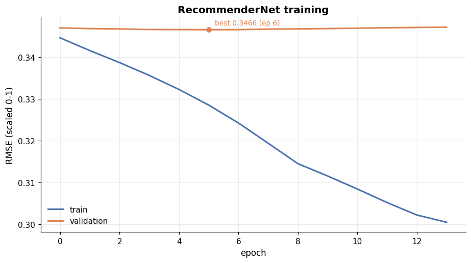

**Cross-model agreement.** The two collaborative models shared only **4.5%** of their top-10 neighbours across 20 popular places — *below* the ~10% expected by chance. Two independent methods disagreeing worse than random is further confirmation that both are fitting noise.

## 15. Evaluation

**Rating prediction:**

| Model | RMSE | MAE | n |
|---|---|---|---|
| Popularity baseline | 1.4122 | 1.2072 | 1,920 |
| Item-based CF | 1.4686 | 1.2450 | 1,920 |
| **Keras MF** | **1.3864** | **1.1795** | 1,920 |

**Top-10 ranking quality:**

| Model | Precision@10 | Recall@10 | **NDCG@10** | Hit rate@10 | **Coverage** |
|---|---|---|---|---|---|
| **Random floor** | 0.0080 | 0.0278 | **0.0195** | 0.0799 | 0.9977 |
| Popularity baseline | 0.0083 | 0.0255 | 0.0161 | 0.0833 | **0.0320** |
| Item-based CF | 0.0087 | 0.0304 | 0.0179 | 0.0764 | 0.9900 |
| Keras MF | 0.0056 | 0.0183 | 0.0143 | 0.0556 | 0.5240 |

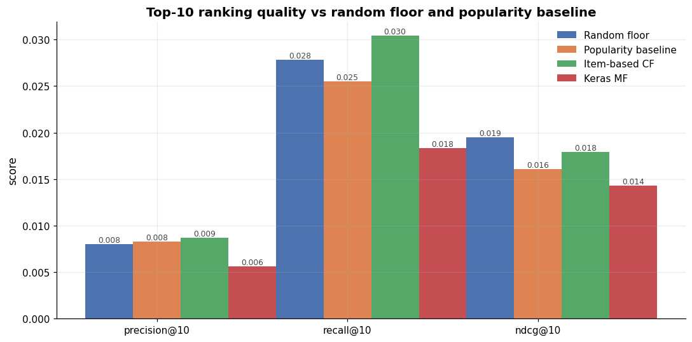

**A recommender that picks places at random ranks first on NDCG@10.** That is the cleanest possible confirmation of §12.

Two observations that matter more than the raw numbers:

1. **Keras MF has the best RMSE but the worst NDCG.** Reporting RMSE alone — the most common choice — would have made the neural model look like the winner, when it is in fact the weakest at the job it exists to do. RMSE ≈ 1.39–1.47 is simply the "predict the global mean" floor, since the standard deviation of the ratings is ≈ 1.41. This single comparison justifies measuring both families of metric.
2. **Catalogue coverage separates the models even when accuracy cannot.** The popularity baseline recommends the same **3.2%** of the catalogue to everyone; item-based CF spans **99.0%**. If the agency's goal is to spread visitors beyond a handful of crowded sites rather than to maximise click-through, coverage is the metric that matters — and it is the one dimension on which the models genuinely differ.

---

## 16. Part 2 conclusions

**EDA findings (tasks 2–4):**

1. The rating population is young (mean age 28.7, range 18–40) and Java-centric. Campaigns built on it address a young domestic audience and should not be extrapolated further.
2. **Yogyakarta is the best city for a nature enthusiast**, winning on both volume (57 nature attractions) and concentration (45.2% of its portfolio), with the highest average listed rating (4.45). Bandung is a close second.
3. Category-level rating differences span only 0.177 points and the bootstrap confidence intervals **overlap** — category is not a usable marketing lever in this data.
4. The most-loved spots were ranked by a Bayesian-adjusted score so that low-volume flukes do not crowd out genuinely popular destinations.

**Recommender findings (task 5):**

5. Both required models were built and evaluated correctly. Item-based CF answers the brief's place-name query directly; the Keras model adds personalised top-N.
6. **No model beats a random recommender**, and §12 explains why: the ratings contain no preference structure to learn. The models are correctly implemented — item-based CF recovers a planted cluster structure on synthetic test data (see `tests/test_pipeline.py::test_item_cf_recovers_cluster_structure`) — so the flat result reflects the data, not a defect.
7. The one qualitative difference that survives is **catalogue coverage**: 99.0% for item-CF against 3.2% for the popularity baseline.

**What the agency should do:**

- Do **not** deploy personalisation on this dataset. Promote destinations by popularity as an interim strategy.
- Begin collecting **real interaction data** — bookings, check-ins, dwell time, or verified reviews, with timestamps. Roughly 50,000–100,000 genuine interactions would support meaningful collaborative filtering at this catalogue size.
- If the goal is to distribute visitors rather than maximise clicks, optimise for **coverage and novelty explicitly**, not accuracy alone.

**Limitations:**

- **The user ratings are synthetic** (§12). This is the dominant limitation; the recommender is best understood as a correctly built system awaiting real data.
- 92.68% sparse matrix; all conclusions rest on 9,597 interactions.
- **No cold-start handling** — a place nobody has rated cannot be recommended. A content-based model over Category/City/Description/Rating would cover that gap, and remains meaningful because those fields *are* genuine.
- **No timestamps**, so the train/test split is random rather than chronological and cannot detect taste drift.
- **Popularity bias** — the system tends to reinforce existing tourist flows.

---

## 17. Overall conclusions and next steps

| | Part 1 | Part 2 |
|---|---|---|
| **Deliverable** | 10-class heritage structure classifier | Item-CF + Keras MF recommender |
| **Headline result** | **95.52% test accuracy, 94.39% macro-F1** | NDCG@10 0.018 vs 0.019 random |
| **Verdict** | Deploy | Do not deploy — collect real data first |
| **Main limitation** | Classifies structure type, not condition | Ratings are synthetic |

**Recommended next phase:**

1. **Condition assessment.** Extend Part 1 from "what is this structure?" to "does it need maintenance?" This requires a labelled damage dataset, which does not currently exist. It is the largest gap between the deliverable and the business goal.
2. **Real interaction data.** Part 2's engineering is sound; it needs genuine data. Instrument bookings and check-ins before revisiting personalisation.
3. **Content-based hybrid.** Category, City, Description and the listed Rating are genuine. A content-based recommender over these fields would work today and would solve the cold-start problem, independent of the synthetic interaction data.
4. **Targeted data collection for `apse`.** The weakest class at 0.737 recall is also the second-rarest at 514 images. More data there will outperform any architectural change.

---

## 18. Reproducibility

```bash
git clone https://github.com/humamibrahim-cyber/heritage-tourism-ai.git
cd heritage-tourism-ai
pip install -r requirements.txt
pytest tests/ -v          # 47 tests
```

All random seeds fixed at 42. Both notebooks run top to bottom in Google Colab; see [`docs/SETUP.md`](https://github.com/humamibrahim-cyber/heritage-tourism-ai/blob/main/docs/SETUP.md) for the required Google Drive layout, and [`docs/REQUIREMENTS_MAPPING.md`](https://github.com/humamibrahim-cyber/heritage-tourism-ai/blob/main/docs/REQUIREMENTS_MAPPING.md) for the mapping of every task in the brief to the code that implements it.

**Engineering approach.** The notebooks orchestrate and narrate; all logic lives in `src/` under test. The 47-test suite covers graph construction and layer-freezing behaviour, callback firing, augmentation semantics, collaborative-filtering cluster recovery, metric correctness, and four regression tests locking down bugs found during development:

| Bug found during development | Regression test |
|---|---|
| Validation split overlapped training by 83% | `test_train_val_split_is_disjoint` |
| PIL accepted JPEGs that TensorFlow rejects | `test_find_undecodable_catches_what_pil_misses` |
| Quarantine folder became an extra class | `test_quarantine_moves_outside_the_split` |
| Unnamed pandas index dropped `place_id` | `test_all_recommenders_return_place_id` |

**Environment:** TensorFlow 2.20, Python 3.12, Google Colab with an L4 GPU. Part 1 runtime ≈ 40 minutes; Part 2 ≈ 5 minutes on CPU.

## 19. References

- Llamas, J., Lerones, P. M., Medina, R., Zalama, E., & Gómez-García-Bermejo, J. (2017). *Classification of Architectural Heritage Images Using Deep Learning Techniques.* Applied Sciences, 7(10), 992.
- Tan, M., & Le, Q. (2021). *EfficientNetV2: Smaller Models and Faster Training.* ICML.
- Sarwar, B., Karypis, G., Konstan, J., & Riedl, J. (2001). *Item-Based Collaborative Filtering Recommendation Algorithms.* WWW.
- Koren, Y., Bell, R., & Volinsky, C. (2009). *Matrix Factorization Techniques for Recommender Systems.* IEEE Computer, 42(8), 30–37.
- Little, R. J. A., & Rubin, D. B. (2019). *Statistical Analysis with Missing Data* (3rd ed.). Wiley. — MCAR/MAR framework used in §8.6.
